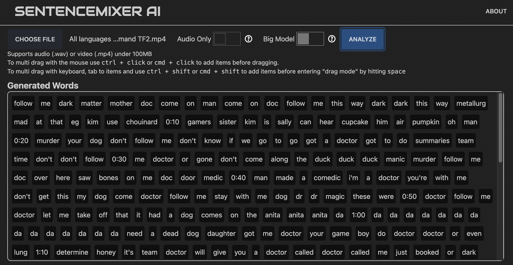
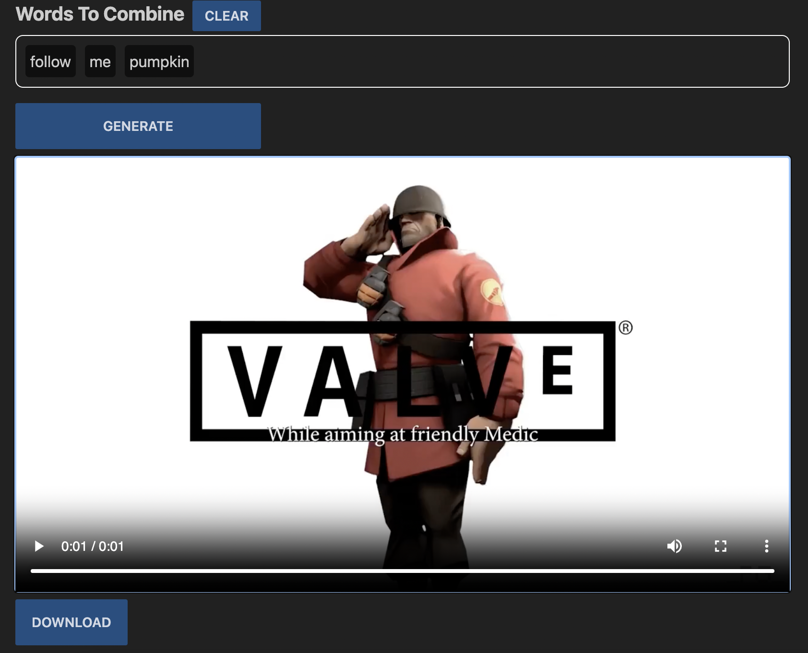

# SentenceMixer AI

A free, anonymous tool for sentence mixing audio and video! Think Youtube poop or SFM style without manual editing.
Voice analysis done via Vosk AI models in the cloud. My goal is to keep this free to use and without registration.
Drag on drop doesn't really work on mobile. I may create a different UI for mobile.

## Demo
[Demo on Vercel](https://sentencemixerai.vercel.app/)

## Usage
1. Choose .wav or .mp4 file
2. Optionally turn on Big Model or Audio Only
3. Hit analyze
4. Filter words and drop them into "Words To Combine" as you like
5. Or, drag final words directly from "Generated Words"
6. Hit generate
7. Preview or download the clip

## Change Log
- 7/26/23: Added multi language support, only small models for Spanish, French, Russian, and German.

## Examples

Output after analysis:

Generating Clip:

Final Clip:
[Download](static/sampleclip.mp4)

