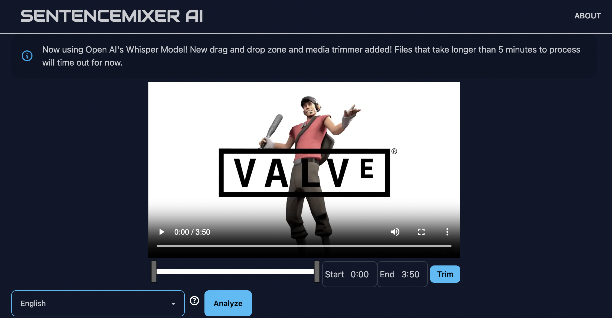
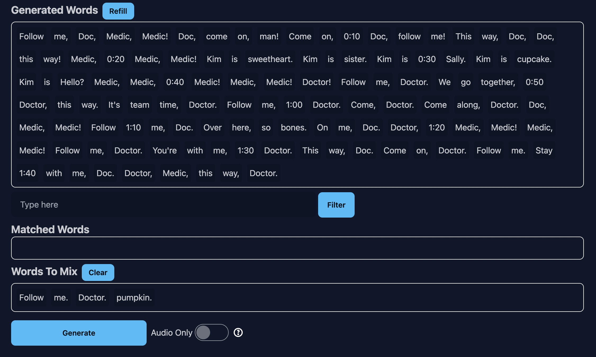

# SentenceMixer AI

A free, anonymous tool for sentence mixing audio and video! Think Youtube poop or SFM style without manual editing.
Voice analysis done via WhisperX on an RTX 3080. My goal is to keep this free to use and without registration.
Feel free to open an issue for suggestions.

## Demo
[Demo on Vercel](https://sentencemixerai.vercel.app/)

## Local Version
[sentencemixerai](https://github.com/stephenswetonic/sentencemixerai)

## Usage
1. Drag and drop an audio or video file or click to pick file.
2. Use the media trimmer to trim the length of the file. This way, you can process shorter clips at a time.
3. Hit analyze.
4. Filter words from the generated words.
5. Or, drag words directly from "Generated Words" into "Words to Mix"
6. Hit generate (with the option to generate as audio only).
7. Preview or download the clip.

## Change Log
- 7/26/23: Added multi language support, only small models for Spanish, French, Russian, and German.
- 2/26/24: AWS Lambda backend testing.
- 2/28/24: AWS lambda backend online.
- 3/4/24:  Big model for English enabled.
- 3/11/24: New drag and drop zone for picking files + media trimmer added.
- 3/25/24: Speech to text processing now done with Open AI Whisper.
- 3/30/24: All languages supported by Whisper added.
- 5/30/24: New backend using WhisperX on RTX 3080.
- 9/15/24: Fixed bug that ignored words dragged from 'matched words'
           Improved overall search field experience.
           Disabled multidrag on 'words to mix' due to bug.

## Languages
The model will auto detect many languages. You can select a specific language to help it detect the language for clips shorter than 30 seconds.
To see all available languages, see [languages.py](python/lambda/languages.py)

## Examples

Uploading and trimming a video:

Generating words:

Sample Clip:
[Download](static/sampleclip.mp4)

### Donations

